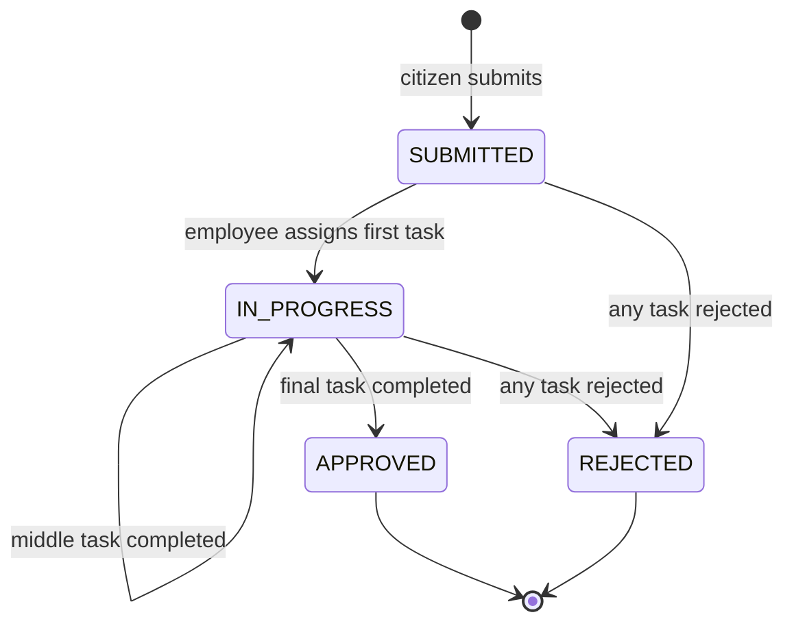
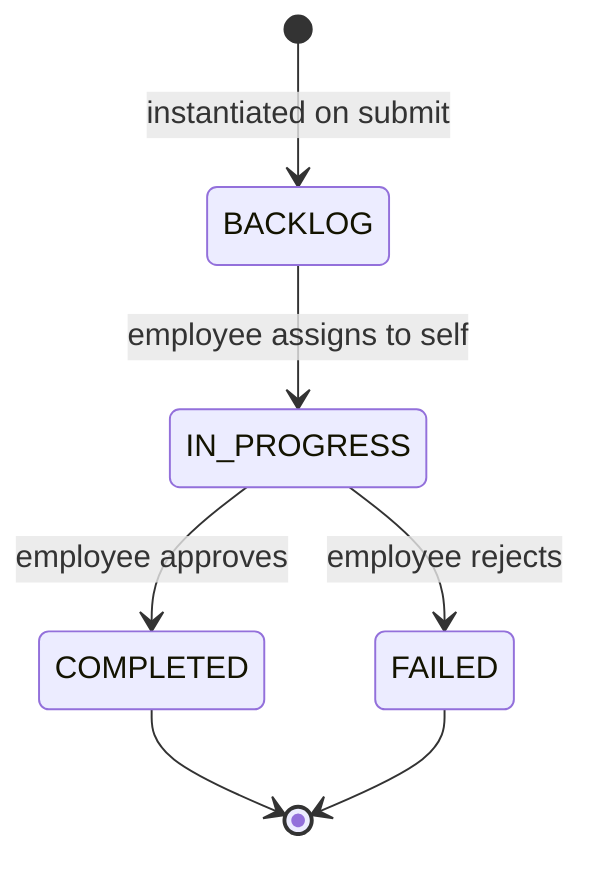

# Service Requests Workflow — Phase 1 Implementation Plan

> **Goal:** End-to-end MVP — citizen submits a published service → workflow tasks are instantiated → employee in the responsible section assigns, completes, or rejects → request reaches `APPROVED` or `REJECTED`.
>
> **Reference:** `TECHNO_AMMAR_MODULES.md` § Module 5 + § Module 6 (subset)  
> **Out of scope for Phase 1:** payments, document uploads, appeals, corrections, pending-info flow, notifications, admin request list.

---

## 1. Scope

### In scope (Phase 1)

| Area | Deliverable |
|------|-------------|
| Database | `ServiceRequest`, `RequestTask`, `RequestActivity` models + enums |
| Citizen API | Submit, list own requests, get detail with task timeline, activity history |
| Employee API | Section task board, task detail, assign-to-self, complete, reject |
| State machine | Request + task transitions for happy path and rejection |
| Validation | Verified citizen, published service, ≥1 active workflow task, free services only (`fee = 0`) |
| Audit | `RequestActivity` log on every transition |
| Guard | Block service soft-delete when non-terminal requests exist |
| Tests | Unit tests per use case (match existing `__tests__/` pattern) |

### Deferred (Phase 2+)

- `RequiredDocument` / `RequestDocument` + file uploads
- `RequestPayment` + payment verification
- `PENDING_INFORMATION`, appeals, corrections
- Notifications module
- `GET /admin/requests`, admin payment views
- `section_id` in JWT (use DB lookup via `IUserRepository` for now)

---

## 2. Architecture

### New module: `service-requests`

Single module for runtime workflow (citizen + employee surfaces), following existing hexagonal layout:

```
src/modules/service-requests/
├── domain/
│   ├── entities/
│   │   ├── service-request.entity.ts
│   │   ├── request-task.entity.ts
│   │   ├── request-activity.entity.ts
│   │   └── service-request-detail.entity.ts   # request + tasks + service name
│   └── repositories/
│       ├── service-request-repository.interface.ts
│       └── request-task-repository.interface.ts
├── application/
│   ├── submit-service-request.use-case.ts
│   ├── list-my-service-requests.use-case.ts
│   ├── get-service-request.use-case.ts
│   ├── get-service-request-history.use-case.ts
│   ├── get-section-task-board.use-case.ts
│   ├── get-request-task.use-case.ts
│   ├── assign-request-task.use-case.ts
│   ├── complete-request-task.use-case.ts
│   ├── reject-request-task.use-case.ts
│   ├── request-workflow.service.ts            # shared transition logic (domain service)
│   ├── service-request-response.mapper.ts
│   └── __tests__/...
├── infrastructure/
│   ├── prisma-service-request.repository.ts
│   └── prisma-request-task.repository.ts
├── presentation/
│   ├── service-requests.controller.ts         # /requests
│   ├── request-tasks.controller.ts            # /tasks
│   └── dto/
│       ├── submit-service-request.dto.ts
│       └── reject-request-task.dto.ts
└── service-requests.module.ts
```

### Path alias

Add to `tsconfig.json` and `package.json` Jest `moduleNameMapper`:

```json
"@service-requests/*": ["./src/modules/service-requests/*"]
```

### Module imports

```typescript
// service-requests.module.ts
imports: [ServicesModule, UsersModule, OrgModule]
```

- `ServicesModule` → `IServiceRepository` (load published service + workflow tasks)
- `UsersModule` → `IUserRepository` (citizen verification, employee `section_id`)
- `OrgModule` → optional section validation

### Wire into `AppModule`

```typescript
imports: [..., ServiceRequestsModule]
```

---

## 3. Database Schema

Add to `prisma/schema.prisma`:

### Enums

```prisma
enum RequestStatus {
  SUBMITTED
  IN_PROGRESS
  APPROVED
  REJECTED
  // Phase 2+: PENDING_INFORMATION, APPEALED, FINAL_REJECTION
}

enum RequestTaskStatus {
  BACKLOG
  IN_PROGRESS
  COMPLETED
  FAILED
  // Phase 2+: ASSIGNED, PENDING_INFO, WAITING_CORRECTION, ...
}

enum RequestPaymentStatus {
  NOT_REQUIRED
  PENDING_VERIFICATION
  PAID
  FAILED
}

enum RequestActivityAction {
  SUBMITTED
  TASK_ASSIGNED
  TASK_COMPLETED
  TASK_REJECTED
  REQUEST_APPROVED
  REQUEST_REJECTED
}
```

### Models

```prisma
model ServiceRequest {
  id              BigInt               @id @default(autoincrement())
  citizen_id      BigInt
  citizen         User                 @relation("CitizenRequests", ...)
  service_id      BigInt
  service         Service              @relation(...)
  status          RequestStatus        @default(SUBMITTED)
  payment_status  RequestPaymentStatus @default(NOT_REQUIRED)
  current_task_id BigInt?
  submitted_at    DateTime             @default(now())
  completed_at    DateTime?
  is_deleted      Boolean              @default(false)
  created_at      DateTime             @default(now())
  updated_at      DateTime             @updatedAt

  tasks      RequestTask[]
  activities RequestActivity[]

  @@index([citizen_id])
  @@index([service_id])
  @@index([status])
  @@map("service_requests")
}

model RequestTask {
  id                   BigInt           @id @default(autoincrement())
  request_id           BigInt
  request              ServiceRequest   @relation(..., onDelete: Cascade)
  service_task_id      BigInt
  service_task         ServiceTask      @relation(...)
  section_id           BigInt           // denormalized for board queries
  section              Section          @relation(...)
  name                 String           // snapshot from ServiceTask
  task_order           Int
  estimated_time_hours Int
  assigned_employee_id BigInt?
  assigned_employee    User?            @relation("AssignedTasks", ...)
  status               RequestTaskStatus @default(BACKLOG)
  assigned_at          DateTime?
  completed_at         DateTime?
  rejection_reason     String?
  created_at           DateTime         @default(now())
  updated_at           DateTime         @updatedAt

  @@unique([request_id, task_order])
  @@index([section_id, status])
  @@index([assigned_employee_id])
  @@map("request_tasks")
}

model RequestActivity {
  id          BigInt                @id @default(autoincrement())
  request_id  BigInt
  request     ServiceRequest        @relation(..., onDelete: Cascade)
  task_id     BigInt?
  actor_id    BigInt
  actor       User                  @relation(...)
  action      RequestActivityAction
  description String?
  created_at  DateTime              @default(now())

  @@index([request_id])
  @@map("request_activities")
}
```

### Relation back-patches

- `User`: `citizen_requests`, `assigned_request_tasks`, `request_activities`
- `Service`: `service_requests ServiceRequest[]`
- `ServiceTask`: `request_tasks RequestTask[]`
- `Section`: `request_tasks RequestTask[]`

### Migration

```bash
npm run db:migrate:dev -- --name add_service_requests
npx dotenv-cli -e .env.dev -- npx prisma generate
```

---

## 4. State Machine (Phase 1)

### Request status



### Task status



### Transition rules

| Action | Preconditions | Side effects |
|--------|---------------|--------------|
| **Submit** | Citizen `ACTIVE` + `is_verified`; service `PUBLISHED` + `is_active`; ≥1 active `ServiceTask`; `fee = 0` | Create request `SUBMITTED`; snapshot all tasks as `BACKLOG`; set `current_task_id` to task with `task_order = 1`; log `SUBMITTED` |
| **Assign** | Actor is `EMPLOYEE` or `DEPARTMENT_MANAGER`; task `BACKLOG`; task `section_id` = actor's `section_id`; request not terminal | Task → `IN_PROGRESS`; set `assigned_employee_id`, `assigned_at`; if request `SUBMITTED` → `IN_PROGRESS`; log `TASK_ASSIGNED` |
| **Complete** | Actor assigned to task OR same section; task `IN_PROGRESS`; request not terminal | Task → `COMPLETED`; if last task → request `APPROVED`, `completed_at`, log `REQUEST_APPROVED`; else `current_task_id` → next task, log `TASK_COMPLETED` |
| **Reject** | Same auth as complete; task `IN_PROGRESS`; `rejection_reason` required | Task → `FAILED`; request → `REJECTED`, `completed_at`; log `TASK_REJECTED` + `REQUEST_REJECTED` |

**Terminal request statuses:** `APPROVED`, `REJECTED` — no further task actions allowed.

**Subsequent tasks after rejection:** remain `BACKLOG` but request is terminal (no processing).

---

## 5. API Endpoints

### Citizen — `ServiceRequestsController` (`/requests`)

| Method | Path | Role | Use case |
|--------|------|------|----------|
| `POST` | `/requests` | `CITIZEN` | `SubmitServiceRequestUseCase` |
| `GET` | `/requests` | `CITIZEN` | `ListMyServiceRequestsUseCase` |
| `GET` | `/requests/:id` | `CITIZEN` | `GetServiceRequestUseCase` |
| `GET` | `/requests/:id/history` | `CITIZEN` | `GetServiceRequestHistoryUseCase` |

**`POST /requests` body:**

```json
{ "service_id": 1 }
```

**`GET /requests/:id` response shape:**

```json
{
  "id": "1",
  "service_id": "2",
  "service_name": "Building Permit",
  "status": "IN_PROGRESS",
  "payment_status": "NOT_REQUIRED",
  "submitted_at": "...",
  "completed_at": null,
  "current_task_id": "5",
  "tasks": [
    {
      "id": "5",
      "name": "Initial Review",
      "task_order": 1,
      "status": "IN_PROGRESS",
      "section_id": "3",
      "assigned_employee_id": "10",
      "estimated_time_hours": 4
    }
  ]
}
```

### Employee — `RequestTasksController` (`/tasks`)

| Method | Path | Role | Use case |
|--------|------|------|----------|
| `GET` | `/tasks/board` | `EMPLOYEE`, `DEPARTMENT_MANAGER` | `GetSectionTaskBoardUseCase` |
| `GET` | `/tasks/:id` | `EMPLOYEE`, `DEPARTMENT_MANAGER` | `GetRequestTaskUseCase` |
| `PUT` | `/tasks/:id/assign` | `EMPLOYEE`, `DEPARTMENT_MANAGER` | `AssignRequestTaskUseCase` |
| `PUT` | `/tasks/:id/complete` | `EMPLOYEE`, `DEPARTMENT_MANAGER` | `CompleteRequestTaskUseCase` |
| `PUT` | `/tasks/:id/reject` | `EMPLOYEE`, `DEPARTMENT_MANAGER` | `RejectRequestTaskUseCase` |

**`GET /tasks/board` response:**

```json
{
  "backlog": [...],
  "in_progress": [...],
  "completed": [...],
  "failed": [...]
}
```

Filtered by actor's `section_id` from `IUserRepository.findById(actorId)`.

**`PUT /tasks/:id/reject` body:**

```json
{ "rejection_reason": "Missing property ownership proof" }
```

### RBAC

- `@UseGuards(JwtAuthGuard, RolesGuard)` on all endpoints (no `@Public()`)
- Citizen endpoints: `@Roles(UserRole.CITIZEN)`
- Task endpoints: `@Roles(UserRole.EMPLOYEE, UserRole.DEPARTMENT_MANAGER)`
- Ownership: citizen can only read own requests; employee can only act on tasks in their section

---

## 6. Repository Contracts

### `IServiceRequestRepository`

```typescript
export const IServiceRequestRepository = Symbol('IServiceRequestRepository');

export interface CreateServiceRequestData {
  citizen_id: bigint;
  service_id: bigint;
  payment_status: RequestPaymentStatus;
  current_task_id: bigint;
  tasks: CreateRequestTaskData[];
  activity: CreateRequestActivityData;
}

export interface IServiceRequestRepository {
  createWithTasks(data: CreateServiceRequestData): Promise<ServiceRequestDetailEntity>;
  findById(id: bigint): Promise<ServiceRequestEntity | null>;
  findByIdWithTasks(id: bigint): Promise<ServiceRequestDetailEntity | null>;
  findByCitizen(citizenId: bigint): Promise<ServiceRequestEntity[]>;
  updateStatus(id: bigint, data: UpdateServiceRequestStatusData): Promise<ServiceRequestEntity>;
  countActiveByServiceId(serviceId: bigint): Promise<number>;
  findActivities(requestId: bigint): Promise<RequestActivityEntity[]>;
  addActivity(data: CreateRequestActivityData): Promise<RequestActivityEntity>;
}
```

`createWithTasks` uses `prisma.$transaction` (same pattern as `PrismaServiceRepository.createWithTasks`).

### `IRequestTaskRepository`

```typescript
export const IRequestTaskRepository = Symbol('IRequestTaskRepository');

export interface IRequestTaskRepository {
  findById(id: bigint): Promise<RequestTaskEntity | null>;
  findByIdWithRequest(id: bigint): Promise<RequestTaskWithRequestEntity | null>;
  findBySection(sectionId: bigint): Promise<RequestTaskEntity[]>;
  update(id: bigint, data: UpdateRequestTaskData): Promise<RequestTaskEntity>;
  findNextTask(requestId: bigint, afterOrder: number): Promise<RequestTaskEntity | null>;
}
```

### Active request guard (for service delete)

Add to `IServiceRequestRepository.countActiveByServiceId`:

```typescript
// status NOT IN (APPROVED, REJECTED) AND is_deleted = false
```

Update `DeleteServiceUseCase` to call this before soft-delete.

---

## 7. Shared Logic — `RequestWorkflowService`

Injectable domain service (application layer) to avoid duplicating transition rules across assign/complete/reject use cases:

```typescript
@Injectable()
export class RequestWorkflowService {
  assertRequestNotTerminal(status: RequestStatus): void;
  assertTaskAssignable(task: RequestTaskEntity, actorSectionId: bigint): void;
  assertTaskCompletable(task: RequestTaskEntity, actorId: bigint, actorSectionId: bigint): void;
  isLastTask(task: RequestTaskEntity, allTasks: RequestTaskEntity[]): boolean;
}
```

Use cases orchestrate; workflow service validates; repositories persist.

---

## 8. Implementation Order

### Step 1 — Schema & scaffolding (≈1 session)

- [ ] Add Prisma enums + models + relations
- [ ] Run migration + generate client
- [ ] Add `@service-requests/*` path alias (tsconfig + jest)
- [ ] Create module skeleton (entities, repo interfaces, empty module)
- [ ] Wire `ServiceRequestsModule` into `AppModule`

### Step 2 — Submit flow (≈1 session)

- [ ] `PrismaServiceRequestRepository.createWithTasks` (transaction)
- [ ] `SubmitServiceRequestUseCase` + tests
- [ ] `ServiceRequestsController` — `POST /requests`
- [ ] Validations: verified citizen, published service, active tasks, fee = 0

### Step 3 — Citizen read APIs (≈0.5 session)

- [ ] `ListMyServiceRequestsUseCase` + `GET /requests`
- [ ] `GetServiceRequestUseCase` + `GET /requests/:id`
- [ ] `GetServiceRequestHistoryUseCase` + `GET /requests/:id/history`
- [ ] Response mapper + tests

### Step 4 — Employee task board (≈1 session)

- [ ] `PrismaRequestTaskRepository`
- [ ] `GetSectionTaskBoardUseCase` — group by status column
- [ ] `GetRequestTaskUseCase` — includes parent request + sibling tasks timeline
- [ ] `RequestTasksController` — `GET /tasks/board`, `GET /tasks/:id`
- [ ] Resolve actor `section_id` via `IUserRepository`

### Step 5 — Task actions (≈1 session)

- [ ] `RequestWorkflowService` + unit tests
- [ ] `AssignRequestTaskUseCase`
- [ ] `CompleteRequestTaskUseCase` (advance `current_task_id` or approve request)
- [ ] `RejectRequestTaskUseCase`
- [ ] `RequestTasksController` — assign / complete / reject
- [ ] Activity logging on each action

### Step 6 — Guards & polish (≈0.5 session)

- [ ] Update `DeleteServiceUseCase` — block if active requests exist
- [ ] Export repos from `ServiceRequestsModule` if needed elsewhere
- [ ] Swagger tags + DTO decorators
- [ ] Full test suite green (`npm test`)

---

## 9. Testing Strategy

### Per use case (required)

| Use case | Key test cases |
|----------|----------------|
| Submit | happy path; unverified citizen; unpublished service; no workflow tasks; fee > 0 |
| Assign | happy path; wrong section; terminal request; task not BACKLOG |
| Complete | middle task advances current_task_id; final task → APPROVED; wrong assignee |
| Reject | sets FAILED + REJECTED; requires reason; terminal request blocked |
| Get board | only returns actor's section tasks |
| Get request | citizen cannot read another citizen's request |

### Test factory pattern (match existing code)

```typescript
function makeServiceRequestRepo(): jest.Mocked<IServiceRequestRepository> { ... }
function makeRequestTask(overrides?: Partial<RequestTaskEntity>): RequestTaskEntity { ... }
```

### Integration (optional Phase 1)

Manual smoke test via Swagger:

1. Admin creates + publishes service with 2 workflow tasks
2. Citizen submits request
3. Employee in section 1 assigns + completes
4. Employee in section 2 assigns + completes → request APPROVED

---

## 10. Phase 2 Preview (after MVP ships)

| Priority | Feature | New models / endpoints |
|----------|---------|------------------------|
| 1 | Required documents | `RequiredDocument`, `RequestDocument`, upload endpoints |
| 2 | Payments | `RequestPayment`, submit + admin verify |
| 3 | Pending info | `PENDING_INFO` status, citizen respond flow |
| 4 | Notifications | hook into `RequestActivity` events |
| 5 | Appeals & corrections | appeal endpoints, correction flow |
| 6 | Admin views | `GET /admin/requests` |

---

## 11. Open Decisions (defaults chosen)

| Decision | Choice | Rationale |
|----------|--------|-----------|
| One module vs two | Single `service-requests` module | Runtime workflow is tightly coupled; mirrors `users` module pattern |
| Paid services in MVP | Block if `fee > 0` | Avoid half-built payment flow |
| Assign status path | `BACKLOG` → `IN_PROGRESS` directly | Skip `ASSIGNED` intermediate state for MVP |
| Manager task access | Same section rules as employee | Manager's `section_id` from user record |
| Soft-delete requests | `is_deleted` flag, not in Phase 1 API | Schema ready for later |

---

## 12. Acceptance Criteria

Phase 1 is **done** when:

1. A verified citizen can submit a request for a published free service
2. Request tasks are created matching the service workflow order
3. An employee in the correct section sees the task on their board
4. Employee can assign, complete (including multi-step), or reject
5. Request reaches `APPROVED` when all tasks complete, or `REJECTED` on failure
6. Citizen can list and view their request with task timeline and activity history
7. Service cannot be deleted while active requests exist
8. All new use cases have unit tests; full suite passes
